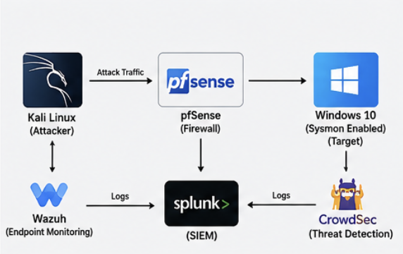
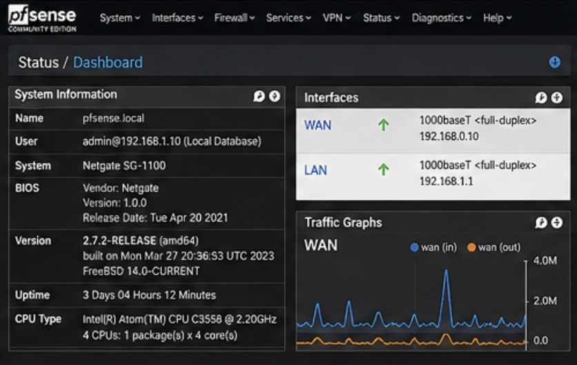
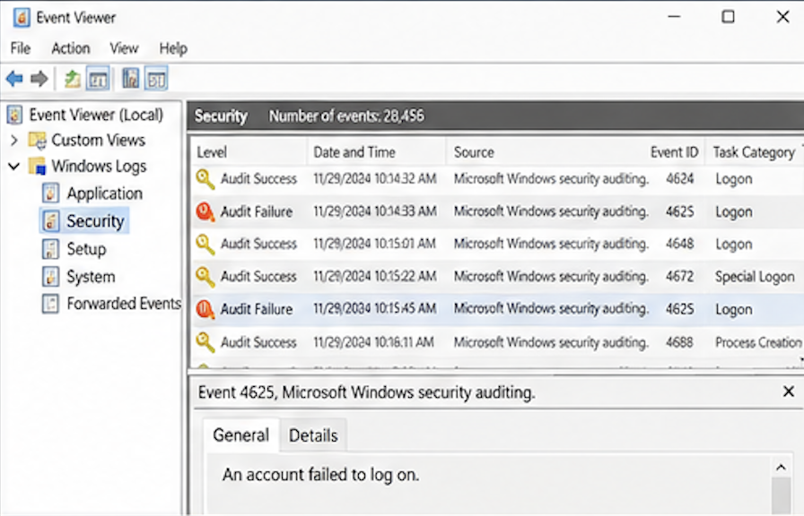
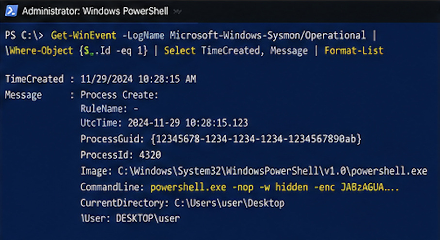
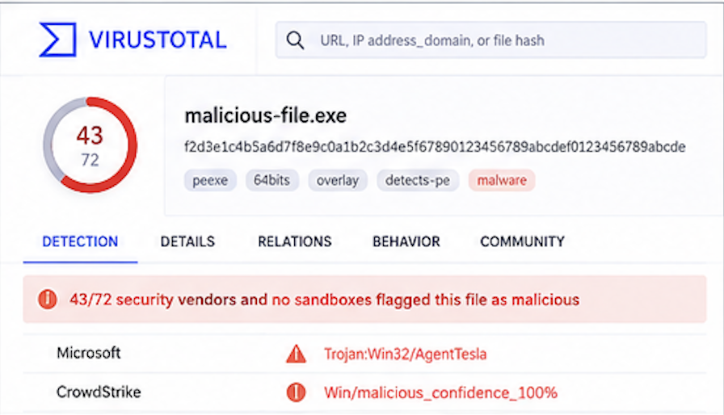

# 🛡️ SOC Home Lab — Security Monitoring & Incident Investigation

### Hands-on SOC Analyst Lab | Threat Detection | Alert Triage | IOC Analysis | Threat Hunting | Incident Response

<p align="center">
  <strong>Detect → Triage → Investigate → Correlate → Hunt → Respond → Document</strong>
</p>

---

## 📌 Overview

This repository documents a hands-on Security Operations Center (SOC) home lab focused on security monitoring, alert triage, log analysis, threat detection, IOC investigation, threat hunting, and incident-response workflows.

The project is designed to build practical SOC Analyst skills by investigating common security events across Windows endpoints and network infrastructure in a controlled lab environment.

Rather than focusing only on cybersecurity theory, this lab follows a structured analyst workflow for understanding alerts, validating suspicious activity, collecting evidence, analyzing telemetry, extracting indicators, correlating events, mapping attacker behavior, and documenting findings.

---

# 🎯 Project Objectives

The SOC Home Lab provides practical exposure to:

- Security monitoring and alert triage
- Windows Event Log analysis
- Sysmon telemetry analysis
- Network traffic investigation
- Firewall and network security monitoring
- IOC extraction and investigation
- Phishing investigation
- Brute-force detection
- Suspicious PowerShell activity detection
- Suspicious DNS activity detection
- Port-scanning investigation
- Malware activity investigation
- MITRE ATT&CK technique mapping
- Incident documentation
- Incident response workflows
- Basic threat hunting

---

# 🏗️ Lab Architecture

The lab is designed around an attacker, network security controls, endpoint telemetry, and SOC investigation activities.

```text
                     ┌──────────────────────┐
                     │       Attacker       │
                     │      Kali Linux      │
                     └──────────┬───────────┘
                                │
                          Attack Traffic
                                │
                                ▼
                     ┌──────────────────────┐
                     │       pfSense        │
                     │ Firewall / Network   │
                     │      Monitoring      │
                     └──────────┬───────────┘
                                │
                         Network Activity
                                │
                                ▼
                     ┌──────────────────────┐
                     │   Windows Endpoint   │
                     │                      │
                     │       Sysmon         │
                     │   Windows Event Logs │
                     └──────────┬───────────┘
                                │
                          Security Events
                                │
                                ▼
                     ┌──────────────────────┐
                     │      SOC Analyst     │
                     │                      │
                     │ Alert Triage         │
                     │ Log Analysis         │
                     │ IOC Investigation    │
                     │ Threat Hunting       │
                     │ Incident Response    │
                     └──────────────────────┘

🔄 SOC Investigation Workflow
Each investigation follows a structured SOC-style workflow:
                 Security Alert
                       │
                       ▼
                Initial Triage
                       │
                       ▼
                Validate Alert
                       │
                       ▼
               Collect Evidence
                       │
                       ▼
                 Analyze Logs
                       │
                       ▼
                 Extract IOCs
                       │
                       ▼
                Correlate Events
                       │
                       ▼
             Map MITRE ATT&CK
                       │
                       ▼
               Determine Impact
                       │
                       ▼
            Response / Escalation
                       │
                       ▼
               Final Disposition
                       │
                       ▼
                Documentation

🧰 Technologies & Tools
Operating Systems
- Windows
- Kali Linux
Security Monitoring
- Windows Event Logs
- Sysmon
- pfSense
- Network Traffic Analysis
Investigation
- Log Analysis
- IOC Analysis
- Timeline Analysis
- Threat Hunting
- MITRE ATT&CK Mapping
🚨 Detection & Investigation Use Cases
The repository contains documentation for common SOC security events.
Use Case	Investigation Focus
🔐 Brute Force	Repeated authentication failures and suspicious login activity
🦠 Malware	Suspicious processes, files and endpoint activity
🎣 Phishing	Suspicious emails, URLs, domains and indicators
🔎 Port Scanning	Network reconnaissance and scanning behavior
🌐 Suspicious DNS	Unusual DNS queries, domains and possible C2 indicators
⚡ Suspicious PowerShell	Potentially malicious PowerShell execution


Detailed detection documentation is available in the [`detections/`](./detections/) directory.
🔐 Brute-Force Investigation
The brute-force investigation focuses on identifying repeated authentication failures and determining whether the activity may indicate credential attacks or account compromise.
Investigation Areas
- Failed authentication attempts
- Source IP addresses
- Target accounts
- Authentication timelines
- Successful login following multiple failures
- Potential account compromise
📄 [View Brute-Force Detection](./detections/brute-force.md)
📄 [View Brute-Force Investigation](./investigations/brute-force-investigation.md)
🦠 Malware Investigation
The malware investigation focuses on identifying suspicious endpoint activity and determining whether processes or files may indicate malicious behavior.
Investigation Areas
- Suspicious processes
- File activity
- Process execution
- Indicators of compromise
- Related network connections
- Potential persistence
📄 [View Malware Detection](./detections/malware.md)
📄 [View Malware Investigation](./investigations/malware-investigation.md)
🎣 Phishing Investigation
The phishing investigation focuses on analyzing potentially malicious emails and identifying associated indicators.
Investigation Areas
- Sender information
- Suspicious URLs
- Domains
- Attachments
- Email headers
- User interaction
- IOC extraction
📄 [View Phishing Detection](./detections/phishing.md)
📄 [View Phishing Investigation](./investigations/phishing-investigation.md)
🔎 Port-Scanning Investigation
The port-scanning investigation focuses on identifying network reconnaissance activity.
Investigation Areas
- Source IP
- Destination host
- Destination ports
- Number of connection attempts
- Scanning patterns
- Potential reconnaissance activity
📄 [View Port-Scanning Detection](./detections/port-scanning.md)
📄 [View Port-Scanning Investigation](./investigations/port-scanning-investigation.md)
🌐 Suspicious DNS Investigation
The suspicious DNS investigation focuses on identifying unusual DNS activity and potential command-and-control indicators.
Investigation Areas
- Queried domains
- Source hosts
- Query frequency
- Unusual domain patterns
- DNS-related IOCs
- Potential C2 indicators
📄 [View Suspicious DNS Detection](./detections/suspicious-dns.md)
📄 [View DNS Investigation](./investigations/dns-investigation.md)
⚡ Suspicious PowerShell Investigation
The PowerShell investigation focuses on identifying potentially malicious PowerShell execution and suspicious process behavior.
Investigation Areas
- PowerShell command lines
- Parent-child process relationships
- Encoded commands
- Suspicious execution patterns
- User context
- Network connections
- Endpoint activity
📄 [View Suspicious PowerShell Detection](./detections/suspicious-powershell.md)
📄 [View PowerShell Investigation](./investigations/powershell-investigation.md)
🧩 IOC Investigation
Indicators of Compromise are analyzed as part of the investigation workflow.
Common IOC Types
IP Address
     │
     ├── Domain
     │
     ├── URL
     │
     ├── File Hash
     │
     ├── File Name
     │
     └── Email Address

IOC Investigation Workflow
IOC Identified
      ↓
Validate Indicator
      ↓
Determine Context
      ↓
Correlate With Logs
      ↓
Search Related Activity
      ↓
Assess Threat
      ↓
Document Findings

📄 [View IOC Investigation Resources](./iocs/README.md)
🧠 SOC Investigation Methodology
The investigations in this project follow a repeatable analyst methodology.
1. Identify
Determine what triggered the security alert.
2. Triage
Assess the alert severity, context, and potential impact.
3. Investigate
Analyze endpoint, authentication, DNS, network, and process activity.
4. Correlate
Connect multiple events and indicators to establish an investigation timeline.
5. Hunt
Search available telemetry for related activity.
6. Map
Map observed behavior to relevant MITRE ATT&CK techniques when supported by evidence.
7. Respond
Determine appropriate containment, remediation, or escalation actions.
8. Document
Record evidence, findings, IOCs, impact, and final disposition.
🗺️ MITRE ATT&CK
MITRE ATT&CK is used to provide context to observed attacker behavior.
Investigation areas may include:
- Initial Access
- Execution
- Persistence
- Privilege Escalation
- Defense Evasion
- Credential Access
- Discovery
- Command and Control
Techniques are mapped only when supported by the investigation evidence.
📝 Incident Documentation
The [`docs/`](./docs/) directory contains an incident-report template designed to document SOC investigations consistently.
The template covers:
- Incident information
- Alert summary
- Investigation timeline
- Evidence collected
- Indicators of compromise
- Investigation findings
- MITRE ATT&CK mapping
- Impact assessment
- Response actions
- Final disposition
- Recommendations
- Lessons learned
📄 [View Incident Report Template](./docs/incident-report-template.md)
📸 Screenshots & Visual References
The [`screenshots/`](./screenshots/) directory contains visual references covering different stages of the SOC investigation workflow.
SOC Home Lab Architecture


pfSense Firewall Dashboard


Windows Event Logs


Sysmon Events


Splunk Brute-Force Detection


Phishing Email Investigation


Suspicious DNS Activity


Suspicious PowerShell Investigation


IOC Investigation


Screenshot disclosure: The visuals in the screenshots/ directory are illustrative/recreated references and are not presented as original historical evidence from the previous lab environment.

📁 [View All Screenshots](./screenshots/)
📊 Analyst Skills Demonstrated
This project demonstrates practical exposure to:
- SOC Alert Triage
- Security Monitoring
- Log Analysis
- Windows Event Logs
- Sysmon Analysis
- Network Security Monitoring
- Phishing Investigation
- Brute-Force Investigation
- Malware Investigation
- PowerShell Investigation
- DNS Investigation
- Port-Scan Investigation
- IOC Extraction
- Threat Hunting
- Timeline Analysis
- MITRE ATT&CK Mapping
- Incident Response
- Incident Documentation
- Security Incident Escalation
🗂️ Repository Structure
Soc-lab/
│
├── detections/
│   ├── brute-force.md
│   ├── malware.md
│   ├── phishing.md
│   ├── port-scanning.md
│   ├── suspicious-dns.md
│   └── suspicious-powershell.md
│
├── investigations/
│   ├── brute-force-investigation.md
│   ├── dns-investigation.md
│   ├── malware-investigation.md
│   ├── phishing-investigation.md
│   ├── port-scanning-investigation.md
│   └── powershell-investigation.md
│
├── iocs/
│   └── README.md
│
├── evidence/
│   └── ...
│
├── docs/
│   └── incident-report-template.md
│
├── screenshots/
│   ├── README.md
│   ├── soc-home-lab-architecture.png
│   ├── pfsense-firewall-dashboard.png
│   ├── windows-event-logs.png
│   ├── sysmon-events.png
│   ├── splunk-bruteforce-detection.png
│   ├── phishing-email-investigation.png
│   ├── suspicious-dns-activity.png
│   ├── suspicious-powershell.png
│   └── ioc-investigation.png
│
└── README.md

🔍 Investigation Documentation
Category	Location
Detection Rules	[`detections/`](./detections/)
Investigations	[`investigations/`](./investigations/)
IOC Resources	[`iocs/`](./iocs/)
Incident Documentation	[`docs/`](./docs/)
Visual References	[`screenshots/`](./screenshots/)


🎓 Learning Outcomes
Through this project, I developed practical understanding of how a SOC analyst approaches security events from initial detection through final documentation.
Key learning areas include:
- Understanding security alerts
- Performing initial alert triage
- Analyzing Windows endpoint telemetry
- Investigating authentication activity
- Reviewing network-related activity
- Identifying suspicious processes
- Extracting and validating IOCs
- Correlating security events
- Building investigation timelines
- Applying MITRE ATT&CK context
- Performing basic threat hunting
- Determining appropriate response actions
- Documenting investigation findings
- Escalating potential security incidents
🚀 Future Improvements
Potential future enhancements include:
- Additional detection use cases
- More endpoint telemetry sources
- Expanded threat-hunting scenarios
- Additional MITRE ATT&CK mappings
- Automated IOC enrichment
- Detection rule development
- SIEM integration
- Automated incident-report generation
- Additional network-security investigations
- Expanded incident-response playbooks
🎯 Project Purpose
This project was created as a practical cybersecurity portfolio project to demonstrate the ability to approach security events from a SOC Analyst perspective rather than only learning cybersecurity concepts theoretically.
The core methodology is:
Detect
  ↓
Triage
  ↓
Investigate
  ↓
Correlate
  ↓
Hunt
  ↓
Respond
  ↓
Document

⚠️ Disclaimer
This project is intended for educational and defensive security purposes within a controlled lab environment.
All testing, attack simulation, and investigation activities should be performed only on systems and networks where appropriate authorization has been obtained.
The screenshots included in this repository are illustrative/recreated visuals and should not be interpreted as original historical evidence from the previous lab environment.
👤 Author
Mittapalli Indu
Cybersecurity | SOC Analyst | Security Operations
GitHub: github.com/Indumittapalli
<p align="center">
  <strong>Cybersecurity • SOC • SIEM • Threat Detection • IOC Analysis • Threat Hunting • Incident Response</strong>
</p>
```
